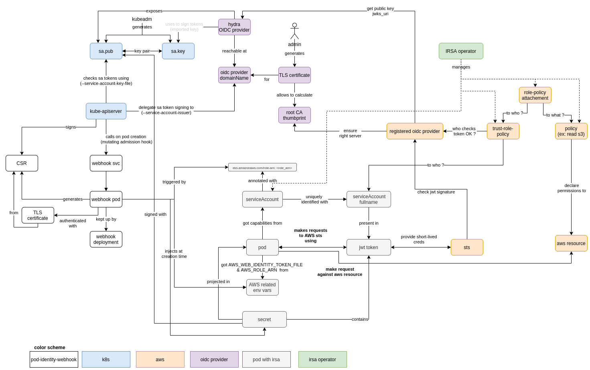

# IRSA operator 


A Kubernetes operator to manage IAM roles & policies needed for IRSA, directly from your EKS cluster

This project is built using the Kubernetes [operator SDK](https://sdk.operatorframework.io/)

## What problem does it solves ?

When using IRSA in order to scope AWS permissions at the pod-level (instead of the usual node-level) you have to define the "absolute path" of the serviceAccount to give it some rights on AWS resources (ie. declare on AWS the exact namespace and name of the serviceAccount allowed to assume the role). This creates an hidden dependency between AWS and your k8s serviceAccount. For instance, you will break the permissions given by the serviceAccount if you just rename it.

Also, the steps to get IRSA working on AWS can be a bit cumbersome (create a policy, create a role, create an assume role policy with not-super-obvious fields).

This operator solves both problems by letting you declare a very simple CRD containing the name of the serviceAccount you want (name of the CRD resource itself) and the permissions you want to give. 
It will automatically create the resources needed on AWS and the serviceAccount in the namespace were you created the CR (see example below).

## Caveat
- oidc must be enabled on your EKS cluster 

## Example

This CRD will allow any pod using the `serviceAccount` named `s3-get-lister` to `Get` and `List` all objects in the s3 bucket with ARN `arn:aws:s3:::test-irsa-4gkut9fl`

```
apiVersion: irsa.voodoo.io/v1alpha1
kind: IamRoleServiceAccount
metadata:
  name: s3-get-lister 
spec:
  policy: 
    statement:
      - resource: "arn:aws:s3:::test-irsa-4gkut9fl"
        action:
          - "s3:Get*"
          - "s3:List*"
```

What this operator does (from a user point of view) :
- create an IAM Policy with the provided statement
- create an IAM Role with this policy attached to it
- create a serviceAccount named as specified with the IAM Role capabilities

you can use the serviceAccount created by the irsa-operator by simply setting its name in your pods `spec.serviceAccountName`

```
apiVersion: apps/v1
kind: Deployment
metadata:
  labels:
    app: irsa-test
  name: irsa-test
spec:
  selector:
    matchLabels:
      app: irsa-test
  template:
    metadata:
      labels:
        app: irsa-test
    spec:
      serviceAccountName: s3-get-lister # <- HERE, simply the name of the IamRoleServiceAccount 
      containers:
      - image: amazon/aws-cli
        name: aws-cli
        command: ["aws", "s3", "ls", "arn:aws:s3:::test-irsa-4gkut9fl"]
```

## installation of the operator

An helm chart is available on this repo, you can use it to install the operator in a cluster.

The operator will use IRSA also to do its job (but you have to do that once per cluster and fields are hardcoded in the helm chart), see see [./_example/terraform/main.tf](./_example/terraform/main.tf ) 

- the `clusterName` is used to avoid name collisions between AWS IAM resources created by different EKS running in the same account, you can use whatever value you want (most likely the EKS cluster name)
- the rolearn is the role the operator will use
- the oidcProviderARN is known at cluster creation (`oidc` must be enabled)


## architecture

Here's how IRSA works and how the irsa-operator interfaces with it



## model

TLA+ formal specification of the way this operator works is available : [./_doc/model/IrsaOperator.pdf](./_doc/model/IrsaOperator.pdf)


## project structure
this project follows the `operator SDK` structure : 
- CR types are declared in `./api/<version>`, the `zz_generated...` file is autogenerated based on other CRs using the `make` command
- Controllers (handling reconciliation loops) are in `./controllers/`, one controller per CR.

## (manual) installation of the operator

### pre-requisites
- kubectl configure to talk to the EKS where you want to install the operator
- a docker registry where the EKS cluster can pull the operator image you'll build
- an IAM role with the ability to create policies, roles, attach policies (use its arn instead of the placeholder `<role_arn>`)

### build the docker image of the controller and push it to an ECR

```
make docker-build docker-push IMG=<image_tag>
```

_NB : it will run all the tests before building the image_

### install with Helm 
```
helm install irsa-operator --set image=<image_tag> --set rolearn=<role_arn> --set oidcProviderARN=<oidcProviderARN> --set clusterName=<desired_identifier> ./config/helm/
```

#### check

you can access operator's logs there :
```
k logs deploy/irsa-operator-controller-manager -n irsa-operator-system -c manager -f
```

### deploy a resource that uses the iamroleserviceaccount CRD 

```
helm install s3lister --set s3BucketName=<bucket_name> ./_example/k8s
```

#### check 
you can access logs of your pod

```
kubectl logs --selector=app=s3lister
```

if you see the listing of your s3 `<bucket_name>`, congratulations ! the pod has been able to achieve this using the abilities you gave it in your `IamRoleServiceAccount.Spec` !


## work on the project
### resources
- [kubebuilder](https://book.kubebuilder.io/)
- [kubernetes operator concurrency model](https://openkruise.io/en-us/blog/blog2.html)

### tests
- check test coverage in your browser with `go tool cover -html=cover.out`

## Release process
### Publish docker image
- create a release with the name `v<version>`
- it will trigger the `publish-docker` workflow and push the docker image to github artefacts

### Publish the helm chart
if the previous step went fine
- update [./config/helm/irsa/Chart.yaml](./config/helm/irsa/Chart.yaml) and set the version to <version>
- it will trigger the `chart-release` workflow, publish the helm chart and create a release called `helm-v<version>`


